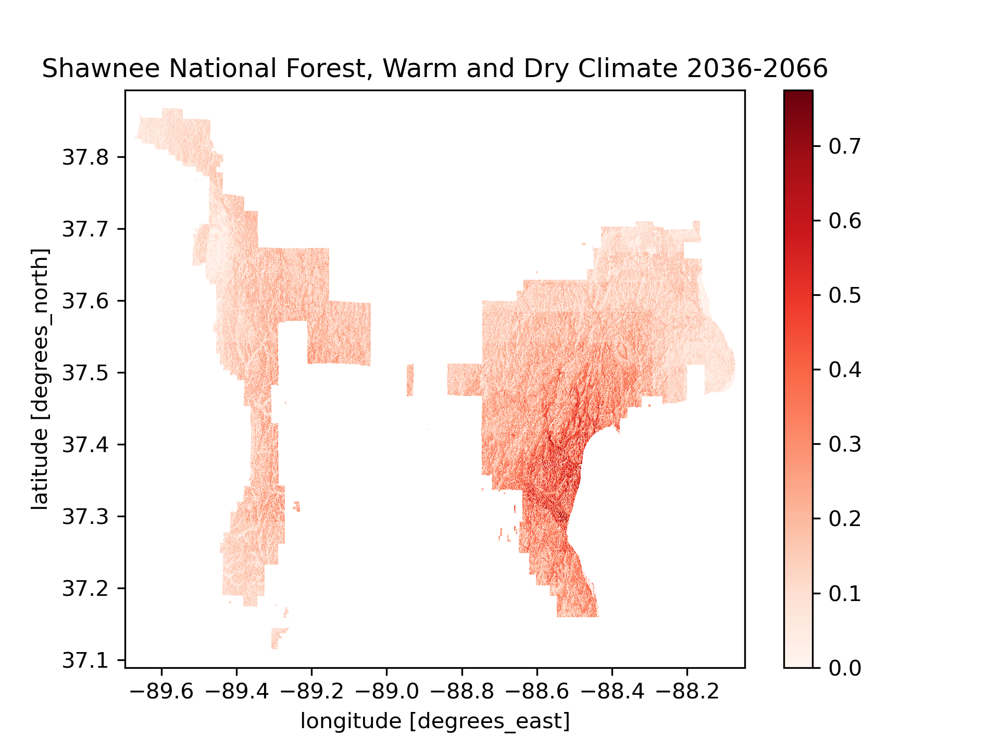
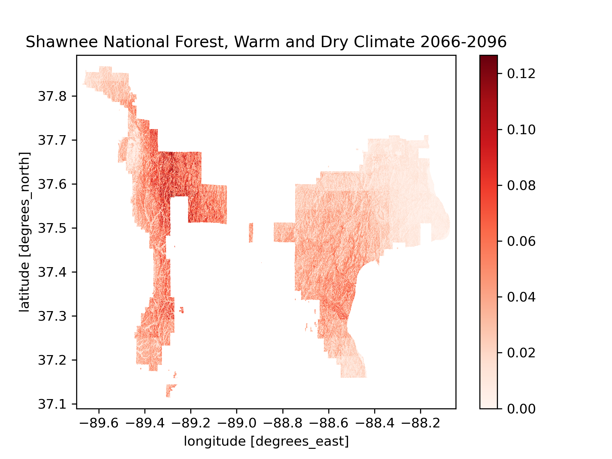
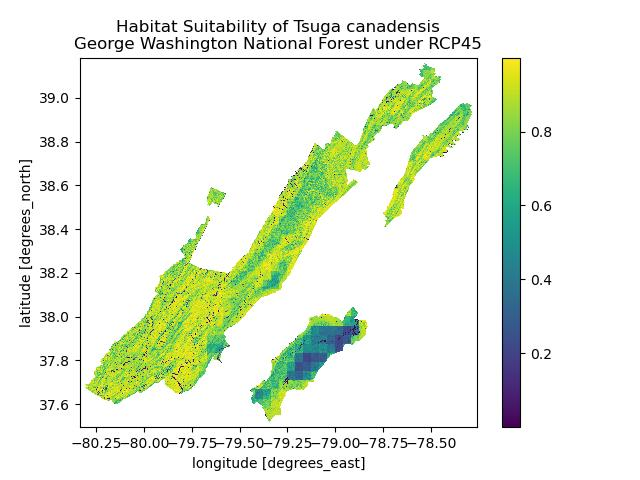
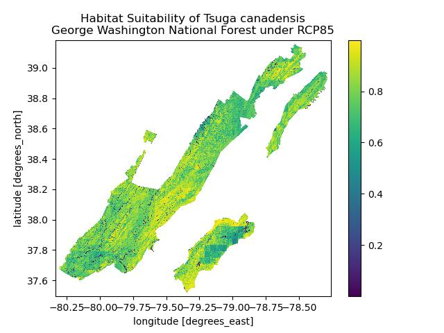
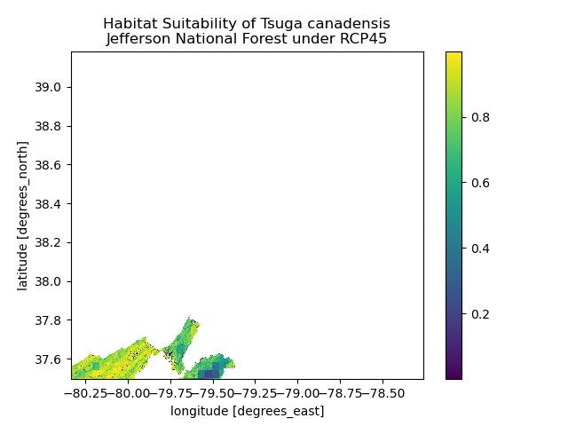
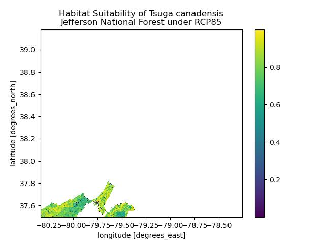

# [Thomas Stogoski](https://tjstogoski.github.io)

Hey! I'm Thomas. I work as a technician at [Banshee Reeks Nature Preserve](https://www.loudoun.gov/1277/Banshee-Reeks-Nature-Preserve), where I focus on habitat restoration and promoting biodiversity. I am also a student of the [Earth Data Analytics Professional Graduate Certificate](https://earthlab.colorado.edu/earth-data-analytics-professional-graduate-certificate) through the Earth Lab at University of Colorado Boulder. Using modern Earth data techniques, I hope to look at vegetation changes over time.

### Contact Information
* Email me at tjstog@gmail.com
* GitHub [tjstogoski](https://github.com/tjstogoski)
* LinkedIn [Thomas Stogoski](https://www.linkedin.com/in/thomas-stogoski-2a803b142/)

## Educational Background
* **Virginia Commonwealth University** - Bachelor of Music in Music Performance
* **Northern Virginia Community College**
  * *Coursework in Biology, Statistics, and Communications*
* **Coastal Carolina University**
  * *Coursework in Ecology, Genetics, Chemistry, Physics, Marine Science, and Geology*

---

## Projects

### Habitat suitability of American Ginseng (*Panax quinquefolius*) under climate change

#### American Ginseng (*Panax quinquefolius*)

American ginseng is a perennial herb native to eastern forests of the United States, from Maine to Alabama and west to Michigan, Wisconsin and Minnesota [(Harrison et al.)](https://corn.aae.wisc.edu/Crops/Ginseng.aspx). The plant grows to two feet in height, has palmately compound leaves made up of five serrated leaflets arranged in a single whorl. It blooms as one greenish-white flower umbel per stem that turn to bright red drupes in the fall.

The root of American Ginseng is where its value to humans lies. Indiginous Americans had a variety of uses for the root; from herbal remedies to good luck charms. In the modern day, it has a high demand in the United States and China as an herbal remedy [(Anderson & Peterson, 2003)](https://plants.usda.gov/DocumentLibrary/plantguide/pdf/cs_paqu.pdf). Overharvesting lead to the plant being listed in Appendix II of the [Convention on International Trade in Endangered Species (CITES)](https://cites.org/eng/app/appendices.php) in the 1970s. Because a permit is not required to export artificially propagated ginseng, agricultural researchers have looked to determine the conditions necessary for growth of the plant.

American ginseng grows best in climates with an average of 50 degrees Fahrenheit and between 40 to 50 in. of annual precipitation. It preferes well-drained, loamy soils at least 12 in. deep with a pH near 5.5 [(Harrison et al.)](https://corn.aae.wisc.edu/Crops/Ginseng.aspx). Ginseng favors north or east facing slopes that are not too steep to maintain deep topsoil [(Vaughan et al., 2011)](https://www.fs.usda.gov/nac/assets/documents/research/publications/2011ginsengforest.pdf).

An example of how American Ginseng may shift is seen at Shawnee National Forest. Under warm and dry climate conditions, the most suitable habitat shifts from the eastern portion of the forest over to the western portion.

[See the full project here](https://github.com/earthlab-education/habitat-suitability-tjstogoski/blob/main/climate.ipynb)

---

### Land Cover Classification in the Mississippi River Delta

This notebook uses a k-means **unsupervised** clustering
algorithm to group pixels by similar spectral signatures. **k-means** is
an **exploratory** method for finding patterns in data. Because it is
unsupervised, no training data is needed for the model. You also
can’t measure how well it “performs” because the clusters will not
correspond to any particular land cover class. However, we expect at
least some of the clusters to be identifiable as different types of land
cover.

We use the [harmonized Sentinal/Landsat multispectral
dataset](https://lpdaac.usgs.gov/documents/1698/HLS_User_Guide_V2.pdf).
The data is accessible with an [Earthdata
account](https://www.earthdata.nasa.gov/learn/get-started) and the
[`earthaccess` library from
NSIDC](https://github.com/nsidc/earthaccess):

**The Mississippi River Delta**

This watershed nestled between the Mississippi River to the West and the small town of Delacroix, Louisiana to the East, near the confluence of the Mississippi River and the Gulf of Mexico. To the Northeast lies Lake Lery, and Grank Lake and Petit Lake to the Southeast. It is a part of a large expanse of coastal wetlands making up 37% of the estuarine herbaceous marshes in the contiguous United States.

Reference:

[Couvillion, B.R., Barras, J.A., Steyer, G.D., Sleavin, William, Fischer, Michelle, Beck, Holly, Trahan, Nadine, Griffin, Brad, and Heckman, David, 2011, Land area change in coastal Louisiana from 1932 to 2010: U.S. Geological Survey Scientific Investigations Map 3164, scale 1:265,000, 12 p. pamphlet.](https://pubs.usgs.gov/sim/3164/)

**LAND COVER CLASSIFICATION REFLECTS PHYSIOGRAPHIC FEATURES**

While the categories of the K-Means classification are not explicitly stated, inferences can be made based on satellite imagery in the visible spectrum. In this instance, possible categories include:

0. (Blue) Deep water bodies, including Lake Lerry to the Northeast, and Grand Lake and Petit Lake to the Southeast.
1. (Yellow) Vegetation, especially the the wide expanses of *Spartina* throughout the delta.
2. (Red) Shallow water bodies, such as the canals that run through the delta, appearing as smooth continuous lines in the figure.
3. (Black) Exposed sediments, such as sandbars or man-made hardscaping. I figured this one out by looking at Google maps streetview of the town of Delacroix, LA, which is just barely seen on the eastern edge of the RGB figure as a white bend. This category may also include the vegetated areas able to support woody growth.

[See the full project here](posts/02-climate/clustering.html)

---

### Habitat Suitability of *Tsuga canadensis* (L.) Eastern Hemlock

Eastern hemlock is a member of the Pine family (Pinaceae) native to northeastern and Appalachian regions of North America. It is a slow growing tree that may take 300 years to reach maturity and then may live beyond 900 years. Additionally, the Eastern hemlock is a host for at least <a href="https://nativeplantfinder.nwf.org/Plants/3396" target="_blank">90 species of butterflies and moths</a>. However, the tree's range is expected to decline due to a combination of global climate change and pressure from <a href="https://plants.usda.gov/DocumentLibrary/plantguide/pdf/cs_tsca.pdf" target="_blank">the Asian hemlock woolly adelgid</a>.

This analysis examines the future habitat suitability for Eastern Hemlock under different climate change scenarios within George Washington National Forest and Jefferson National Forest. The sites were chosen because of their continuous range, stretching most of the range of Virginia's Appalachian region. The two climate change scenarios, described in the <a href="https://www.ipcc.ch/site/assets/uploads/2018/04/ipcc_ar5_leaflet.pdf" target="_blank">IPCC Fifth Assessment Report (AR5)</a>, project future greenhouse gas concentrations. RCP 4.5 is described as an intermediate scenario where emissions peak around 2040. RCP describes a scenario where emissions continue to rise throughout the 21st century and is generally the basis of a worst-case climate change scenario.

The analysis employs a fuzzy logic model using a <a href="https://www.mathworks.com/help/fuzzy/gaussmf.html" target="_blank">Gaussian membership function</a> to assign suitability scores between 0 and 1 for raster data of the following variables:
* Soil pH - taken at 30-60 cm in depth and obtained from the <a href="http://hydrology.cee.duke.edu/POLARIS/PROPERTIES/v1.0/" target="_blank">Polaris dataset</a>.
* Topographic slope - derived from elevation data of the SRTMGL1 NASA Shuttle Radar Topography Mission Global 1 arc second V003 dataset through the [earthaccess API](https://github.com/nsidc/earthaccess/).
* Precipitation - from the <a href="http://thredds.northwestknowledge.net:8080/thredds/reacch_climate_CMIP5_macav2_catalog2.html" target="_blank">MACAv2 THREDDS data server</a>. This analysis uses Bei-jing Normal University Earth System Model for projected climate data of the end of the 21st century.

Tolerable variable ranges for *Tsuga canadensis* were obtained from <a href="https://plants.usda.gov/plant-profile/TSCA" target="_blank">USDA Plants Database</a> for Soil pH and Precipitation needs. Optimal values were derived by taking an average of the upper and lower thresholds. Slope preference of *Tsuga canadensis* is described in <a href="https://www.srs.fs.usda.gov/pubs/ja/ja_narayanaraj001.pdf" target="_blank">Narayanaraj, Bolstad, Elliott, and Vose, 2010</a>.

#### Results
 

Though much of George Washington National Forest will remain habitable for *Tsuga canadensis* at the end of the century, a decrease in habitat is expected if emissions continue to rise as described by the RCP 8.5 scenario. However, the Southeastern region of the forest may see an increase in Eastern hemlock, possibly due to a wetter climate.

 

Unfortunately, an error occurred during the processing of the raster layers for Jefferson National Forest, resulting in only the Northeastern tip of the forest being shown. However, we can still see similarity to George Washington National Forest, where overall habitat may decline in quality but Eastern regions may see an increase in available habitat for Eastern hemlock. This will be looked at again when I next revist the project.

**Formal data citations to come**

<a href="https://github.com/tjstogoski/Habitat-Suitability" target="_blank">See the full project here</a>

---
 
### [50 Years of Temperature Data Show Rising Temperatures at Back Bay National Wildlife Refuge, VA](posts/02-climate/Back_Bay_NWR_climate_analysis.html)

From 1954 to 2006, Back Bay NWR has warmed an average of 0.087&deg;C per year. At 0.87&deg;C per decade, this rate of warming is over four times that of the <a href="https://www.climate.gov/news-features/understanding-climate/climate-change-global-temperature" target="_blank">global rate of warming from 1982 to 2023 as calculated by NOAA (0.20&deg;C per decade)</a>. It was interesting to note the period of cooler temperatures observed starting in 1982, which coincided with a <a href="https://psl.noaa.gov/enso/climaterisks/years/top24enso.html" targe="_blank">strong El Nino event</a>. Looking into this also lead me to learn about the <a hre="https://volcano.oregonstate.edu/el-chichon-mexico-1982" target="_blank">El Chichon volcanic eruption of 1982</a>, which also likely contributed to cooler temperatures, as the aerosol sulfur dioxide emitted from the eruption reflects solar radiation.
[See the full post here](posts/02-climate/Back_Bay_NWR_climate_analysis.html)

---

### Map of Banshee Reeks Nature Preserve

Banshee Reeks Nature Preserve (BRNP) protects 695 acres of the Northern Virginia Piedmont through a conservation easement held by the Virginia Outdoors Foundation. It is managed by the Department of Parks, Recreation & Community Services of Loudoun County, Virginia, USA. The map shows the forests, fields, wetlands, and waters that make up the preserve and serve to teach us of the natural and cultural resources of the region.

<embed type="text/html" src="img/brnp_map.html" width="600" height="600">
