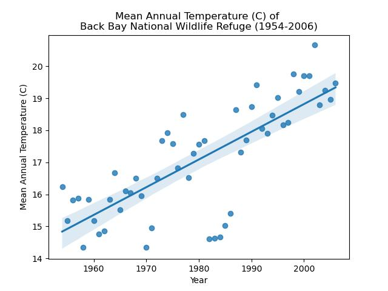

# [Thomas Stogoski](https://tjstogoski.github.io)

Hey! I'm Thomas, environmental professional. I work as a technician at [Banshee Reeks Nature Preserve](https://www.loudoun.gov/1277/Banshee-Reeks-Nature-Preserve), where I focus on habitat restoration and promoting biodiversity. I am also a student of the [Earth Data Analytics Professional Graduate Certificate](https://earthlab.colorado.edu/earth-data-analytics-professional-graduate-certificate) through the Earth Lab at University of Colorado Boulder. Using modern Earth data techniques, I hope to look at vegetation changes over time.

### Contact Information
* Email me at tjstog@gmail.com
* GitHub [tjstogoski](https://github.com/tjstogoski)
* LinkedIn [Thomas Stogoski](https://www.linkedin.com/in/thomas-stogoski-2a803b142/)

## Educational Background
* **Virginia Commonwealth University** - Bachelor of Music in Music Performance
* **Northern Virginia Community College**
  * *Additional coursework in Biology, Statistics, and Communications*
* **Coastal Carolina University**
  * *Additional coursework in Ecology, Genetics, Chemistry, Physics, Marine Science, and Geology*

## Projects
 
### 50 Years of Temperature Data Show Rising Temperatures at Back Bay National Wildlife Refuge, VA

From 1954 to 2006, Back Bay NWR has warmed an average of 0.087&deg;C per year. At 0.87&deg;C per decade, this rate of warming is over four times that of the <a href="https://www.climate.gov/news-features/understanding-climate/climate-change-global-temperature" target="_blank">global rate of warming from 1982 to 2023 as calculated by NOAA (0.20&deg;C per decade)</a>. It was interesting to note the period of cooler temperatures observed starting in 1982, which coincided with a <a href="https://psl.noaa.gov/enso/climaterisks/years/top24enso.html" targe="_blank">strong El Nino event</a>. Looking into this also lead me to learn about the <a hre="https://volcano.oregonstate.edu/el-chichon-mexico-1982" target="_blank">El Chichon volcanic eruption of 1982</a>, which also likely contributed to cooler temperatures, as the aerosol sulfur dioxide emitted from the eruption reflects solar radiation.
[See the full post here](posts/02-climate/Back_Bay_NWR_climate_analysis.html)

### Map of Banshee Reeks Nature Preserve
<embed type="text/html" src="img/brnp_map.html" width="600" height="600">
